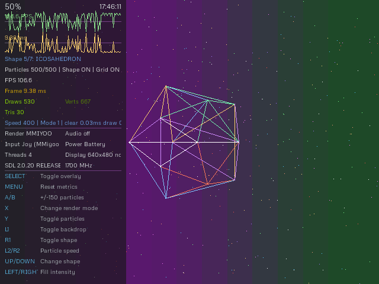
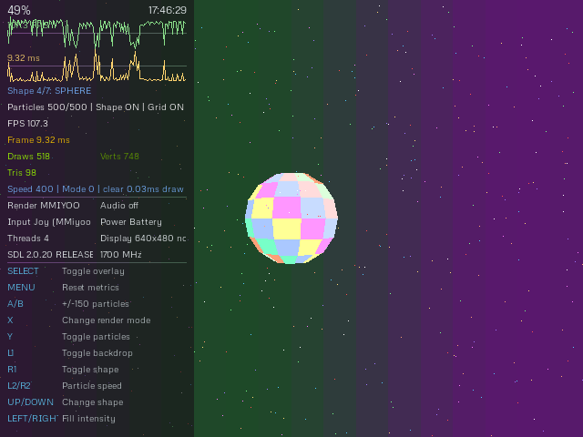
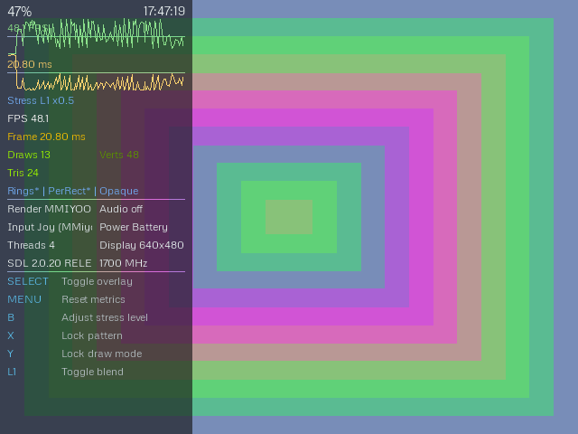
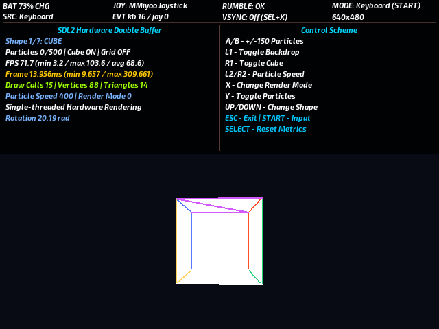
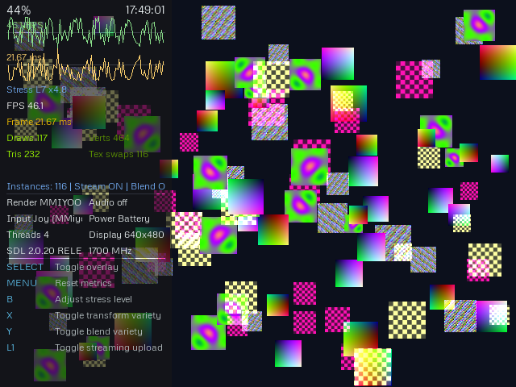
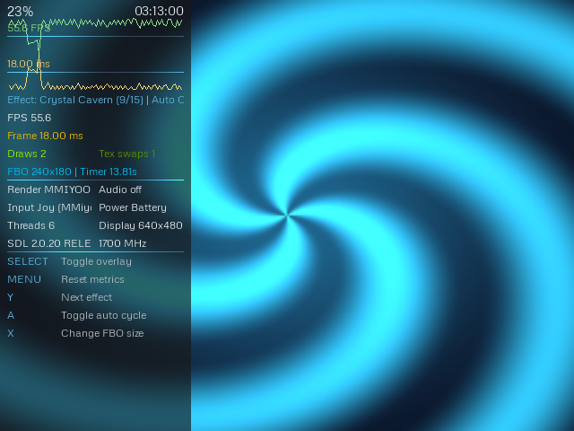
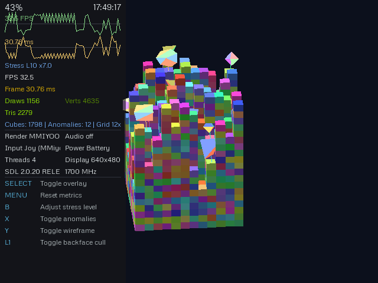
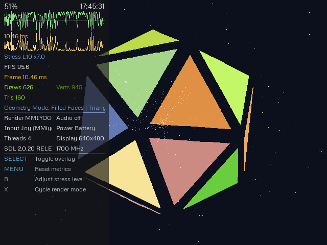

# Miyoo SDL2/OpenGL Benchmarks

SDL2 benchmark programs for the Miyoo Mini. The project is used to exercise
rendering, audio, OpenGL ES, and SDL2 backend behaviour against a custom SDL2
build for the device.

The generated package is written to `app-dist/sdl_bench/`.

> **AI disclosure:** there's been a substantial usage of various LLM in this
> project to both write the code & maintain the repo itself.

## Screenshots

<div align="center">

<table>
  <tr>
    <td align="center"></td>
    <td align="center"></td>
  </tr>
  <tr>
    <td align="center"></td>
    <td align="center"></td>
  </tr>
  <tr>
    <td align="center"></td>
    <td align="center"></td>
  </tr>
  <tr>
    <td align="center"></td>
    <td align="center"></td>
  </tr>
</table>

</div>

## Requirements

- Docker, for the cross-compilation container used by mm-buildbot.
- Git, used to obtain mm-buildbot when it is not already checked out.
- A Miyoo Mini SD card or deployment target for running the packaged app.

The build is delegated to the current `main` branch of
`XK9274/mm-buildbot`. mm-buildbot owns the Miyoo toolchain, SDL2 core, Neon
helper, and SDL2 add-on builds. The benchmark repository only builds the
benchmark sources and stages the application.

## Build

Build all benchmark binaries and prepare the distribution package:

```bash
./build.sh
```

Use verbose output when diagnosing build issues:

```bash
./build.sh --verbose
```

The build process:

- locates or clones a local mm-buildbot checkout;
- builds or reuses the shared SDL2 provider packages;
- compiles the benchmark binaries with the project `Makefile`;
- copies the resulting ARM binaries and provider runtime libraries into
  `app-dist/sdl_bench/`.

The root `build.sh` script is the main entry point.

## Local Build

For local development, point the build at an existing mm-buildbot checkout:

```bash
MM_BUILDBOT_DIR=/path/to/mm-buildbot ./build.sh
```

Already-built provider bundles can be supplied for faster local iteration:

```bash
MM_BUILDBOT_DIR=/path/to/mm-buildbot \
MMIYOO_SDL2_PREFIX=/path/to/sdl2-mmiyoo-lib/bundle \
MMIYOO_SDL2_ADDONS_PREFIX=/path/to/sdl2-mmiyoo-addons/bundle \
./build.sh
```

If no checkout is supplied, `build.sh` looks for `../mm-buildbot` and then
clones `mm-buildbot/main` into `../.mm-buildbot-cache/mm-buildbot`. Override
the cache path with `MM_BUILDBOT_CACHE_DIR`.

```bash
MM_BUILDBOT_CACHE_DIR=/path/to/cache ./build.sh
```

The buildbot providers supply SDL2, SDL2_ttf, SDL2_gfx, SDL2_image, EGL/GLES,
and the Neon helper consistently for the benchmark and other applications.

## Installation

Copy the generated app directory to the Miyoo Mini SD card:

```text
app-dist/sdl_bench/ -> /mnt/SDCARD/App/sdl_bench/
```

Then restart MainUI or reboot the device. The app appears under Apps as
`SDL Benchmark`.

When launched normally, `app-dist/sdl_bench/launch.sh` starts `sdl2_title`,
the themed launcher/title screen, from which you pick and configure a suite
to run. Each suite run writes its own log under `app-dist/sdl_bench/logs/`.

The launcher also has two diagnostic entry points:

```bash
./launch.sh --gdb <binary-name> [port]
./launch.sh --geometry <tag> [duration_s]
```

`--gdb` starts one binary under `gdbserver`. `--geometry` runs the render
suite's geometry scene only and tags its periodic FPS output for A/B testing.

## Benchmarks

- `sdl2_title`
  - Themed launcher/title screen shown when the app starts.
  - Lets you pick a suite, configure resolution/vsync/frame-limit/input, and
    launches the selected binary; shows live battery/backend status.

- `sdl2_bench_double_buf`
  - Exercises hardware double buffering in the SDL2 Miyoo backend.
  - Uses MI_GFX and MI_SYS backed presentation paths.
  - Renders particle and cube-style geometry workloads.

- `sdl2_render_suite`
  - Runs a broader 2D rendering workload set.
  - Includes fill, line, texture, geometry, scaling, memory, and pixel scenes.

- `sdl2_gl_fbo_effects`
  - Renders 15 shader-based effects offscreen into a hidden window's FBO and
    reads the pixels back with `glReadPixels`, composited via the ordinary 2D
    `SDL_Renderer`. Does not exercise a real on-screen GL swap chain.

- `sdl2_audio_bench`
  - Exercises SDL2 audio device setup and buffer behaviour.
  - Includes waveform and sample playback related checks.

- `sdl2_space_bench`
  - Runs an interactive space shooter style benchmark.
  - Exercises sprites, particles, projectiles, drones, anomalies, GL effects,
    overlay rendering, and runtime metrics.

- `sdl2_sprite_bench`
  - Fullscreen bouncing/morphing sprite stress test, deliberately without an
    overlay/HUD or vsync, to isolate the render/present path from the
    overlay code every other suite carries.

- `sdl2_gfx_bench`
  - Cycles antialiased shapes, rounded rects, polygons, bezier curves, and
    thick lines via SDL2_gfx's software primitive renderer.
  - Exercises CPU-side rasterization independent of the hardware-accelerated
    `SDL_Renderer` path the other suites use.

- `sdl2_obj_model_loader`
  - Loads a low-poly Wavefront OBJ/MTL model (falling back to a built-in
    placeholder cube if none is bundled) and renders it as an auto-rotating
    turntable, with manual orbit/zoom and a wireframe toggle.
  - Exercises OBJ/MTL parsing (via tinyobjloader-c) and texture loading
    entirely separately from a hand-written CPU-side model/view/projection,
    near-plane clipping, backface culling, and flat-lit shading pipeline,
    drawn through `SDL_RenderGeometry` -- no OpenGL is used for this suite's
    3D rendering.

## Build Flow

```text
./build.sh
  -> locate or clone mm-buildbot/main
  -> build sdl2-mmiyoo-lib and sdl2-mmiyoo-addons through mm-buildbot
  -> compile the benchmark source against those provider bundles
  -> stage binaries, assets, and runtime libraries
```

The generated `app-dist/sdl_bench/lib/` directory contains the runtime
libraries staged by the buildbot SDL providers.

## Directory Layout

```text
miyoo_sdl2_benchmarks/
|-- build.sh                       # Standalone mm-buildbot-backed build entry point
|-- Makefile                       # Benchmark build configuration
|-- README.md
|-- TODO.md
|-- app-dist/
|   `-- sdl_bench/                 # Device package
|       |-- assets/                # Runtime assets
|       |-- bin/                   # Built benchmark binaries
|       |-- lib/                   # Runtime libraries bundled with the app
|       |-- logs/                  # Runtime-generated benchmark logs
|       |-- config.json
|       `-- launch.sh
|-- assets/                        # README screenshots
|-- build/                         # Local/generated build output
|-- include/                       # Shared headers and GLES headers
|-- src/
|   |-- audio_bench/
|   |-- common/
|   |-- double_buf/
|   |-- gfx_bench/
|   |-- gl_fbo_effects/
|   |-- obj_model_loader/
|   |-- render_suite/
|   |-- space_bench/
|   |-- sprite_bench/
|   `-- title/                     # Launcher/title screen (sdl2_title)
`-- ../.mm-buildbot-cache/         # Default mm-buildbot checkout cache (sibling dir)
```

## Asset Credits

- `app-dist/sdl_bench/assets/bgm.wav`: [Audio Test](https://pixabay.com/music/video-games-arcade-beat-323176/)
  by [NoCopyrightSound633](https://pixabay.com/users/nocopyrightsound633-47610058/).
- `app-dist/sdl_bench/assets/ThaleahFat.ttf`: [Free Pixel Font Thaleah](https://tinyworlds.itch.io/free-pixel-font-thaleah)
  by [Tiny Worlds](https://tinyworlds.itch.io/).
- `app-dist/sdl_bench/icon.png`: [Pixel Skill Icons Pack - 250 Warrior Abilities](https://batareya.itch.io/pixel-skill-icons-pack-250-warrior-abilities)
  by [batareya](https://batareya.itch.io/).
