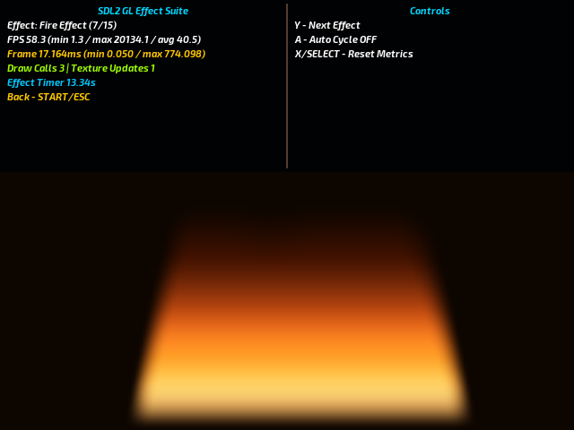

# Miyoo SDL2/OpenGL Benchmarks

<div align="center">

<table>
  <tr>
    <td align="center"></td>
    <td align="center"></td>
  </tr>
  <tr>
    <td align="center"></td>
    <td align="center"></td>
  </tr>
  <tr>
    <td align="center"></td>
    <td align="center"></td>
  </tr>
  <tr>
    <td align="center"></td>
    <td align="center"></td>
  </tr>
  <tr>
    <td align="center"></td>
    <td align="center"></td>
  </tr>
  <tr>
    <td align="center"></td>
    <td align="center"></td>
  </tr>
</table>

</div>

## Description

This repository contains SDL2 benchmark tests that measure rendering performance on the Miyoo Mini handheld device. The benchmarks test various SDL2 rendering techniques including software/hardware double buffering, comprehensive rendering suites for SDL2 native rendering, and OpenGL ES, aswell as audio backend testing.

## Quick Start

### Building from Source

```bash
# Clone the repository
git clone https://github.com/XK9274/miyoo_sdl2_benchmarks
cd miyoo_sdl2_benchmarks

# Run the Docker build script
./docker-compile.sh

# Copy to your Miyoo Mini
app-dist/sdl_bench # Will contain the ready-to-use package w/ bin/lib/scripts. 
```

**Verbose Mode**: Add `--verbose` flag for detailed compilation output:
```bash
./docker-compile.sh --verbose
```

**What the build does:**
1. **Downloads toolchain** - Clones `union-miyoomini-toolchain` automatically
2. **Sets up Docker environment** - Builds cross-compilation container
3. **Compiles SDL2 libraries** - Builds SDL2, SDL2_ttf, SDL2_mixer for linking
4. **Cross-compiles benchmarks** - Creates ARM binaries for Miyoo Mini
5. **Packages distribution** - Prepares `app-dist/sdl_bench/` ready for device

## Installation on Miyoo Mini

### Direct Installation
1. **Copy the app directory** to your Miyoo Mini SD card:
   ```bash
   # After building, copy the distribution package
   cp -r app-dist/sdl_bench /mnt/SDCARD/App/
   ```

2. **Restart MainUI** or reboot your Miyoo Mini

3. **Launch benchmarks** - Navigate to Apps → "SDL Benchmark"

## Benchmarks Included

### Performance Tests
- **SDL2 Software Double Buffer** (`sdl2_bench_software_double_buf`)
  - Manually creates a software backbuffer in the test, disables hardware accelerated double buffering (internally in the mmiyoo backend)
  - Particle systems and geometry rendering

- **SDL2 Hardware Double Buffer** (`sdl2_bench_double_buf`)
  - Tests hardware-accelerated double buffering
  - Uses MI_GFX / MI_SYS to stand up double buffering internally within the SDL2 mmiyoo backend
  - Particle systems and geometry rendering as a cube.

- **SDL2 Render Suite** (`sdl2_render_suite`)
  - Comprehensive rendering test battery
  - Multiple test scenes: fills, rapid line drawing, textures churn

- **SDL2 Render Suite GL** (`sdl2_render_suite_gl`)
  - Lightweight OpenGL ES effect sampler
  - Demonstrates simple shader-based visuals suited for the Miyoo Mini

- **SDL2 Audio Benchmark** (`sdl2_audio_bench`)
  - Audio performance testing
  - Audio device proving, testing samples/buffers etc.

- **SDL2 Star Wing Bench** (`space_bench`)
  - Space shooter game with performance metrics
  - Player movement, projectiles, drones, anomalies, effects system

## Build System Architecture

### Docker Pipeline
```
User runs ./compile.sh
       ↓
Clone union-miyoomini-toolchain
       ↓
Build Docker container (miyoomini-toolchain)
       ↓
Copy scripts to Docker workspace
       ↓
Run mksdl2.sh inside container:
  • Download SDL2 source packages
  • Configure for arm-linux-gnueabihf
  • Cross-compile SDL2 libraries
  • Install to toolchain sysroot
       ↓
Run Makefile inside container:
  • Cross-compile benchmark sources
  • Link against compiled SDL2 libs
  • Generate ARM binaries
       ↓
Copy binaries to app-dist/sdl_bench/bin/
       ↓
Ready for Miyoo Mini deployment!
```

## Directory Structure

```
miyoo_sdl2_benchmarks/
├── 🐳 docker-compile.sh           # Master Docker orchestration script
├── ⚙️  compile.sh                  # User-facing compilation script
├── 🔧 mksdl2.sh                   # SDL2 library compilation script
├── 📋 Makefile                    # Benchmark build configuration
│
├── 📁 src/                        # Source code
│   ├── common/                    # Shared utilities
│   ├── audio_bench/              # Audio benchmark
│   ├── double_buf/               # Hardware double buffer test
│   ├── software_buf/             # Software double buffer test
│   ├── render_suite/             # Comprehensive render tests
│   ├── render_suite_gl/          # OpenGL ES effect sampler
│   └── space_bench/              # Star Wing space shooter benchmark
│
├── 📁 include/                    # Header files
├── 📁 build/                      # Compiled binaries (generated)
│   └── bin/                      # ARM executables
│
├── 📁 app-dist/                   # Distribution package
│   └── sdl_bench/               # Ready for Miyoo deployment
│       ├── bin/                 # Benchmark executables
│       ├── lib/                 # Required runtime libraries
│       ├── assets/              # Assets (audio, textures)
│       ├── config.json          # App configuration
│       └── launch.sh            # Launch script
│
└── 📁 union-miyoomini-toolchain/ # Cross-compilation toolchain (auto-cloned)
    ├── Dockerfile               # Toolchain container setup
    ├── Makefile                # Toolchain build system
    └── workspace/              # Docker build workspace
```

## Troubleshooting

### Build Failures
```bash
# Check Docker is running
docker --version && docker info

# Force rebuild toolchain
cd union-miyoomini-toolchain && make clean && make .build

# Use local build mode (if toolchain already set up)
./compile.sh --local

# Enable verbose output for debugging
./compile.sh --verbose
./compile.sh --local --verbose
```

### Missing Binaries
```bash
# Check if compilation succeeded
ls -la build/bin/
ls -la app-dist/sdl_bench/bin/

# Manually copy if needed
cp build/bin/* app-dist/sdl_bench/bin/
```

## Assets used:

[Audio Test](https://pixabay.com/music/video-games-arcade-beat-323176/) by [NoCopyrightSound633](https://pixabay.com/users/nocopyrightsound633-47610058/)
